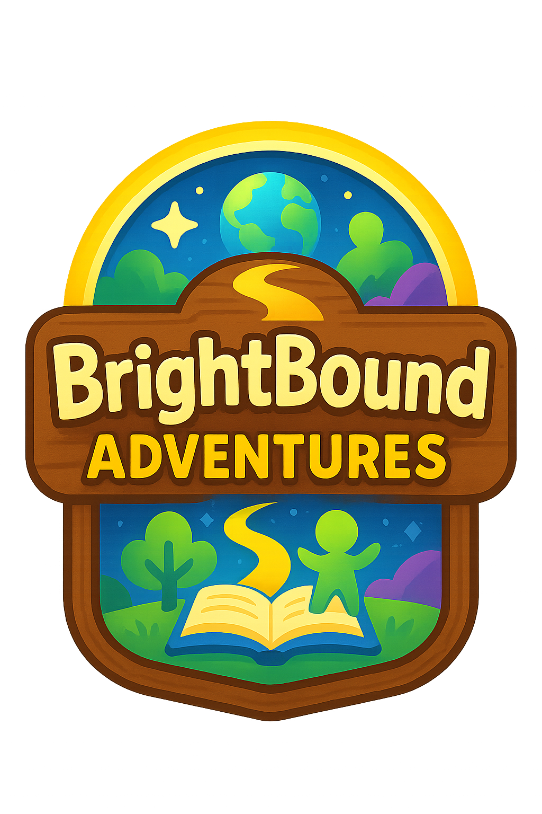

<p align="center">
  
</p>

<h1 align="center">BrightBound Adventures</h1>

<p align="center">
  <strong>A free, offline, child-safe educational adventure for children aged 4–12</strong><br/>
  Aligned to the Australian Curriculum (ACARA v9.0) &amp; NAPLAN
</p>

<p align="center">
  <a href="https://playbrightbound.pages.dev"></a>
  &nbsp;
  
  &nbsp;
  
  &nbsp;
  
</p>

---

## 🌟 What Is BrightBound Adventures?

BrightBound Adventures is a **gamified learning platform** built in Flutter Web. Children explore seven themed worlds, each targeting a different area of the Australian Curriculum. Every session adapts to the child's performance in real time — harder when they're flying, gentler when they need support.

| Feature | Detail |
|---|---|
| 🎯 Ages | 4–12 (differentiated difficulty levels 1–5) |
| 📚 Curriculum | ACARA v9.0 · NAPLAN focus areas |
| 🌐 Platform | Flutter Web PWA · Cloudflare Pages |
| 🔒 Privacy | 100 % offline-capable · zero tracking · no accounts |
| 🤖 AI Questions | Cloudflare Workers AI (Llama 3.1 8B) — new questions every session |
| 🏆 Engagement | Streaks · XP · avatar cosmetics · daily challenges · zone celebrations |

---

## 🗺️ The Seven Worlds

| Zone | Subject Area | Skills |
|---|---|---|
| 🌲 **Word Woods** | English Literacy | Phonics · spelling · homophones · apostrophes · comprehension · grammar |
| 🔢 **Number Nebula** | Mathematics | Place value · fractions · word problems · measurement · geometry · time |
| 📖 **Story Springs** | Creative Writing | Narrative structure · emotion recognition · descriptive language · dialogue · plot |
| 🧩 **Puzzle Peaks** | Logic & Reasoning | Pattern recognition · analogies · sequences · spatial reasoning · deduction |
| 🔬 **Science Explorers** | Science | Biological · earth & space · physical sciences (ACARA F–6) |
| 🎨 **Creative Corner** | Arts | Visual arts · music · colour theory · famous artists |
| ⚡ **Adventure Arena** | Health & PE | Coordination · reflexes · teamwork · Australian sport & geography |

---

## ✨ Key Features

### 🧠 Adaptive Difficulty (SM-2 Spaced Repetition)
Skills progress through four stages:

```
LOCKED ──► INTRODUCED ──► PRACTISING ──► MASTERED
           (~65% acc)      (consistent)   (~85% acc, few hints)
```

The engine uses the SM-2 spaced repetition algorithm to schedule skill reviews, ensuring children revisit content at the optimal interval before it fades.

### 🤖 AI-Generated Questions
Each zone is backed by a **Cloudflare Workers AI** endpoint that generates fresh, curriculum-aligned multiple-choice questions on demand using `@cf/meta/llama-3.1-8b-instruct`. Questions are cached locally for 7 days so the app remains fully offline — but every week brings a new wave of variety.

### 🏅 Engagement & Motivation
- **Daily Challenges** — a fresh hand-picked task every day
- **7-Day Streak Tracking** — with milestone celebrations at 7, 14, 30 days
- **Zone Mastered Celebration** — full-screen animation when a zone is conquered
- **XP & Levelling** — children earn XP for every correct answer
- **Avatar Cosmetics** — outfits and accessories unlock as skills are mastered
- **Micro-animations** — confetti, emoji bursts, and animated avatars to reinforce correct answers

### 👨‍👩‍👧 Parent Dashboard
- PIN-protected access
- Live charts: XP over time, skill accuracy, daily active time
- Skill-by-skill breakdown per zone
- Streak history calendar

### 🔒 Privacy & Safety
| ✅ | Feature |
|---|---|
| ✅ | Offline-first — works without internet |
| ✅ | No analytics, no telemetry |
| ✅ | No ads, no in-app purchases |
| ✅ | No accounts, no email, no passwords |
| ✅ | All data stored locally (Hive) on the device |
| ✅ | AI questions fetched anonymously — no child data sent |
| ✅ | PIN-protected parent area |

---

## 🏗️ Architecture

```
lib/
├── core/
│   ├── models/          # Skill, Avatar, GameProgress, NaplanQuestion…
│   ├── services/        # ServiceRegistry, AiQuestionService, SpacedRepetition,
│   │                    #   Streak, DailyChallenge, AdaptiveDifficulty…
│   ├── utils/           # Zone question generators + static question banks
│   └── data/            # Zone/guardian data, NAPLAN question sets
├── features/
│   ├── literacy/        # Word Woods screens, widgets, models
│   ├── numeracy/        # Number Nebula screens, widgets, models
│   ├── storytelling/    # Story Springs screens, widgets, models
│   ├── logic/           # Puzzle Peaks screens, widgets, models
│   ├── science/         # Science Explorers screens, widgets, models
│   ├── creative/        # Creative Corner screens, widgets, models
│   └── arena/           # Adventure Arena screens, widgets, models
├── ui/
│   ├── themes/          # Material 3 colour tokens, typography
│   ├── widgets/         # Shared widgets: avatar, streak modal, celebration…
│   └── screens/         # Splash, world map, parent dashboard, onboarding
└── main.dart            # MultiProvider bootstrap via ServiceRegistry

workers/
└── question-gen/        # Cloudflare Worker — AI question generation endpoint
    ├── index.js
    └── wrangler.toml

assets/
├── images/              # Zone art, avatar sprites, logo
├── sounds/              # BGM, SFX
└── fonts/               # Fredoka, Comfortaa, NotoEmoji
```

### Service Initialization Order
```dart
ServiceRegistry.initializeAll()
  1. LocalStorageService   (Hive)
  2. AchievementService
  3. ShopService
  4. AdaptiveDifficultyService
  5. AudioManager
  6. CosmeticUnlockService
  7. StreakService
  8. SoundEffectsService
  9. DailyChallengeService
  10. HapticService
  11. SpacedRepetitionService
  12. AiQuestionService     (loads SharedPreferences cache)
```

---

## 🚀 Getting Started

### Prerequisites
- Flutter SDK ≥ 3.19 (stable channel)
- Dart ≥ 3.3
- A Cloudflare account (free) for AI question generation

### Local Development
```bash
git clone https://github.com/theantipopau/brightbound_adventures.git
cd brightbound_adventures
flutter pub get
flutter run -d chrome
```

### Build for Web
```bash
flutter build web --release
```

### Deploy to Cloudflare Pages
```bash
npx wrangler pages deploy build/web --project-name=playbrightbound
```

### Deploy the AI Question Worker
```bash
cd workers/question-gen
npx wrangler deploy
# Note the *.workers.dev URL and update workerUrl in ai_question_service.dart
```

---

## 🎨 Design System

### Colour Palette
| Token | Hex | Use |
|---|---|---|
| Primary | `#FF6B9D` | Buttons, highlights |
| Secondary | `#4ECDC4` | Accents, badges |
| Tertiary | `#FFA500` | XP, streak flames |
| Success | `#06A77D` | Correct answers |
| Error | `#E63946` | Wrong answers |

### Zone Colours
| Zone | Colour |
|---|---|
| Word Woods | `#2D5016` Forest Green |
| Number Nebula | `#1B1F3B` Deep Indigo |
| Puzzle Peaks | `#8B4513` Warm Brown |
| Story Springs | `#4A90E2` Sky Blue |
| Science Explorers | `#1A6B8A` Ocean Teal |
| Creative Corner | `#C2185B` Vivid Pink |
| Adventure Arena | `#9B59B6` Purple |

### Typography
- **Fredoka** — headlines and zone titles
- **Comfortaa** — body text and UI labels
- **NotoEmoji** — emoji fallback (bundled, prevents CanvasKit download stall)

---

## 📚 Curriculum Alignment

### Literacy (NAPLAN Focus Areas)
- Homophones · silent letters
- Apostrophes · comma usage · sentence punctuation
- Pronoun reference · verb tense consistency
- Inference · main idea · author intent
- Reading comprehension · vocabulary in context

### Numeracy (NAPLAN Focus Areas)
- Multi-step word problems
- Fractions, decimals, and mixed quantities
- Place value and number sense
- Time elapsed · measurement · area & perimeter
- Data interpretation · chance & probability
- Pattern rules and algebraic thinking

### Science (ACARA F–6)
- Biological sciences: living things, food chains, ecosystems, life cycles, human body
- Earth & space: water cycle, weather, seasons, solar system, rocks & fossils
- Physical sciences: forces, materials, light, sound, energy, simple machines

### Logic & Reasoning
- Number and letter sequences (arithmetic, geometric, Fibonacci)
- Analogies · odd-one-out · logical deduction
- Spatial reasoning · compass directions · 3D shape properties

---

## 🛠️ Tech Stack

| Layer | Technology |
|---|---|
| Framework | Flutter 3.x Web |
| State Management | Provider + ChangeNotifier |
| Local Storage | Hive (offline-first NoSQL) + SharedPreferences |
| AI Questions | Cloudflare Workers AI (`@cf/meta/llama-3.1-8b-instruct`) |
| HTTP Client | `http` package (Dart) |
| Hosting | Cloudflare Pages |
| Analytics | None (by design) |

---

## 📋 Development History

| Phase | Description | Status |
|---|---|---|
| Phase 1 | Project scaffold, models, routing, PWA setup | ✅ |
| Phase 2 | Avatar creator, world map, XP & levelling, cosmetics | ✅ |
| Phase 2.5 | Learning engine, skill persistence, parent dashboard | ✅ |
| Phase 3 | Word Woods · Number Nebula · Story Springs modules | ✅ |
| Phase 4 | Puzzle Peaks · Adventure Arena mini-games | ✅ |
| Phase 5 | PWA polish, offline validation, Cloudflare Pages deploy | ✅ |
| Phase 6 | Streaks, daily challenges, zone mastered celebrations, micro-animations | ✅ |
| Phase 7.1 | Science Explorers + Creative Corner zones | ✅ |
| Phase 7.2 | Content expansion: 700+ static questions across all zones | ✅ |
| Phase 8 | SM-2 spaced repetition, parent dashboard charts, NotoEmoji fix | ✅ |
| Current | AI question generation (Cloudflare Workers AI) + extended question banks | ✅ |

---

## 🤝 Contributing

This is a private project. If you have been granted contributor access:

1. Branch from `main` — name your branch `feature/<short-description>`
2. Follow the existing file structure (feature-first, then core)
3. Run `flutter analyze` and ensure zero errors before PR
4. Question banks go in `lib/core/utils/*_question_bank.dart`
5. New static questions must include: `id`, `skillId`, `question`, `options[4]`, `correctIndex`, `difficulty` (1–5), `topic`, `hint`, `explanation`

See [CONTRIBUTING.md](CONTRIBUTING.md) for full guidelines.

---

## 📝 License

© 2025–2026 BrightBound Adventures. All rights reserved.  
Unauthorised copying, distribution, or modification is prohibited.

---

<p align="center">
  Made with ❤️ in Australia &nbsp;·&nbsp; Built with Flutter &nbsp;·&nbsp; Powered by Cloudflare
</p>

