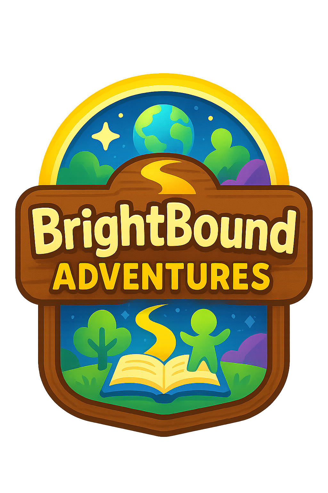
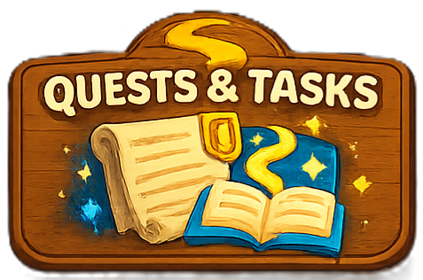
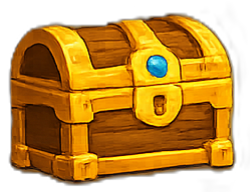
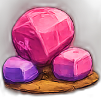
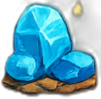
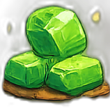
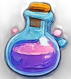
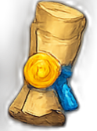

<div align="center">
  

  # BrightBound Adventures

  **A colourful, offline-first learning RPG for children aged 4-12.**

  [](https://flutter.dev)
  [](https://dart.dev)
  [](https://playbrightbound.matthurley.dev)
  
  

  [Play now](https://playbrightbound.matthurley.dev) | [v2.1 roadmap](docs/V2_1_PREMIUM_AUDIT_AND_ROADMAP.md) | [Changelog](CHANGELOG_CODEX.md)
</div>

---

## Learn, explore, collect

```text
world map -> quest -> practise -> XP and stars -> visible rewards -> next quest
```

Children create a companion, explore an isometric board-game world, practise literacy, numeracy, science, logic, storytelling, and motor skills, then spend earned stars on cosmetic rewards.

<div align="center">
  
  
  
  
</div>

## What is playable

| Area | Experience |
|---|---|
| Adventure | Eight unlockable zones, avatar travel, quest board, and game shortcuts |
| Learning | Literacy, numeracy, science, logic, storytelling, motor activities, and mini-games |
| Character | Companion creation, outfits, levels, cosmetic unlocks, and equip flows |
| Motivation | XP, stars, streaks, daily challenges, achievements, bosses, mastery, and Star Shop |
| Replayability | Session history, question freshness, variation, and spaced-repetition foundations |
| Insight | Profile statistics and parent dashboard |
| Comfort | Light/dark/system themes, high contrast, larger text, reduced motion, keyboard and touch |

> [!NOTE]
> BrightBound is feature-rich but not yet at the next premium release bar. The June 2026 audit found unfinished content paths, fragmented styling, world-map maintainability and theme gaps, and missing release-level visual/performance tests. See the [v2.1 Premium Audit & Roadmap](docs/V2_1_PREMIUM_AUDIT_AND_ROADMAP.md).

## Eight learning worlds

| Word Woods | Number Nebula | Math Facts | Story Springs |
|---|---|---|---|
| Reading and spelling | Number sense | Arithmetic fluency | Stories and language |

| Science Explorers | Creative Corner | Puzzle Peaks | Adventure Arena |
|---|---|---|---|
| Discovery | Creative expression | Logic and patterns | Mixed challenges |

## Visual direction

BrightBound bundles Fredoka, Comfortaa, Noto Emoji, distinct zone palettes, layered surfaces, reward art, and event-driven celebrations. v2.1 focuses on a cohesive token system, authored zone art, a rebuilt map, and equally intentional light and dark compositions.

<div align="center">
  
  
  
  
  
</div>

## Privacy, accessibility, and platforms

- Offline-first Hive/shared-preferences storage; no advertising or social feed.
- Responsive Flutter UI for web, phone, and tablet.
- Light, dark, system, high-contrast, larger-text, and reduced-motion modes.
- Mouse, touch, stylus, trackpad, keyboard, text-to-speech, and optional sound foundations.

Accessibility and theme parity are v2.1 release gates, including contrast, focus, 200% text, reduced motion, and target viewports.

## Architecture

```text
lib/core       services, learning logic, models, data, utilities
lib/features   literacy, numeracy, science, logic, storytelling, motor, teacher
lib/ui         screens, widgets, themes, painters, effects
test           unit and responsive/widget smoke tests
website        public marketing site
brightbound-api Cloudflare Worker API and D1 configuration
```

State uses `provider`; persistence uses Hive and shared preferences. Optional online capabilities live behind the Worker project.

## Run and verify

```powershell
flutter pub get
flutter run
dart format --output=none --set-exit-if-changed lib test
flutter analyze
flutter test
flutter build web --release
```

If Flutter is not on `PATH`, this workspace has used `E:\Flutter\flutter\bin\flutter.bat`. The web build may report a known third-party `flutter_tts_web` Wasm dry-run warning.

## Deploy

Root `wrangler.toml` targets Flutter Pages; `website/` contains the marketing site; `brightbound-api/` contains the Worker/D1 API.

```powershell
flutter build web --release
wrangler pages deploy build/web --project-name=playbrightbound
cd brightbound-api
npm.cmd run deploy
```

## Project status

Current version: `2.0.0+2`. Proposed milestone: **v2.1 Living World**.

- [Premium Audit & Roadmap](docs/V2_1_PREMIUM_AUDIT_AND_ROADMAP.md) - source of truth.
- [Current next steps](docs/NEXT_STEPS.md) | [Changelog](CHANGELOG_CODEX.md)
- [Architecture](docs/ARCHITECTURE.md) | [Developer setup](docs/DEV_SETUP.md) | [Contributing](docs/CONTRIBUTING.md)

Older phase/session/completion documents are historical snapshots; validate their claims against the app, tests, and current roadmap.

---

<div align="center"><strong>Built to make practice feel like a place children want to return to.</strong></div>
